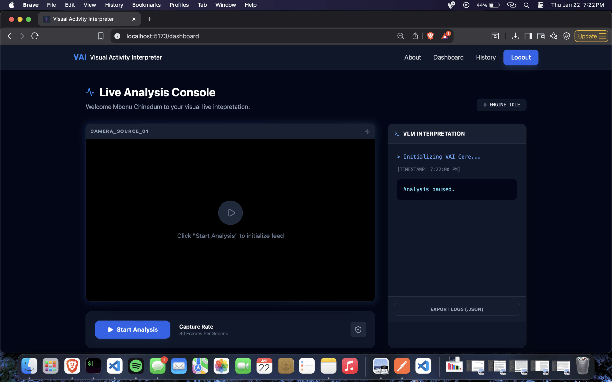

# Visual Activity Interpreter

<h3> Home Page </h3>


<h3> Data Flow Diagram </h3> 


<h3> Introduction </h3>
This repository contains a high-performance **Visual Language Interpretation** system that processes real-time camera frames to identify and display user activities. By leveraging **Computer Vision**, **Deep Learning** and **Vision Language Models**, the program provides immediate, context-aware feedback by overlaying activity descriptions directly onto the video stream.

The architecture follows a cloud-native design pattern, ensuring scalability and efficient model inference.

## 🚀 Features


**Real-Time Video Analysis:** Processes live camera feeds to interpret human actions and gestures.

**Intelligent Overlay:** Displays a responsive and intuitive front-end that provides immediate user feedback based on model outputs.

**Computer Vision Backbone:** Utilizes **OpenCV** and **TensorFlow** (CNN models) for high-accuracy visual recognition.


**Scalable Backend:** Integrated via **Python/Node.js** services to manage state and serve model inferences.


## 🛠️ Technical Stack

**AI/ML:** Python, TensorFlow, Keras, OpenCV.

**Frontend:** React.js for the real-time visualization interface.

**Backend:** Flask (RESTful APIs), Ollama Gemma3.

**Cloud/DevOps:** AWS/Digital Ocean for hosting and data assets, with CI/CD via GitHub Actions.

## 🏗️ Architecture

The program follows an end-to-end pipeline designed for low-latency interpretation:

**Data Ingestion:** High-volume video frames are captured and pre-processed using custom extraction modules.

**Model Inference:** Features are extracted and passed through optimized **Deep Learning Vison** models.

**Visualization:** The React.js frontend renders the live stream with a dynamic UI layer that "interprets" the action in real-time.

## Dependencies For MacOS 

**Postgresql** : Ensure you install postgresql using the command line interface. 

```bash 
brew install postgresql
```


## 🔧 Installation & Setup

1. **Download Ollama**
<p> Go to the ollam page, and download ollama for your distribution, and install it on your local machine. This module is what is responsible for running the LLM model locally on your machine </p>

2. **Install Gemma3**
<p> After installing ollama on your distribution, open a terminal and type the following commands. </p>

```bash 
    $ ollama run gemma3
```

<p> This would download and install <b> gemma3 </b> VLM model on your computer. Once it is done installing, exit out of the terminal and follow the next commands </p> 

3. **Clone the repository:**
<p> Clone the respository using the commands below, and change directory into the repository directory after download </p>  

```bash
    $ git clone https://github.com/cboychinedu/visual-activity-interpreter.git

    $ cd visual-activity-interpreter

```

3. **Environment Setup For Backend:**
<p> Ensure you have <b>Python 3.x</b>, <b>Node.js</b> and <b> Postgresql </b> installed. After installing python, Nodejs and Postgresql, change directory into the backend firstly and install the necessary modules. 
</p>

```bash
$ cd backend/
$ pip install -r requirements.txt
```

4. **Environment Setup For Frontend:**
<p> Ensure you have the recent version of <b> Node.js </b>, for this, change directory into the frontend directory and type the following commands. </p>

```bash 
$ cd ../ 
$ cd frontend/
$ npm install . 
```

5. **Setting your environment values inside the backend folder:** 
<p> To ensure your code works properly, ensure you have the .env files in the backend directory. Create a .env file inside the <b>backend</b> folder, and fill it with the following values, and add your parameters. </p>

```bash
SECRET_KEY=""
DATABASE_HOST="localhost"
DATABASE_PORT="5432" 
DATABASE_PASSWORD=""
DATABASE_NAME=""
```

6. **Setting environment values inside the frontend folder:**
<p>
Ensure you have your environment variables set inside your frontend directory. Create a .env file inside your <b>frontend</b> folder, and fill the following by specifying your backend server ip address: 
</p>

```bash 
REACT_APP_SERVER_URL=""
```

7. **🚀 Deployment:**
<p>
This system is designed to be deployed using a split-architecture: the Frontend is served as static files, and the Backend runs as a persistent service on a Linux VPS. 

<ol>
<li> Digital Ocean / AWS Setup 
<ul>
<li> Recommended instance: Ubuntu 22.04 LTS with at least 8GB RAM (to support Gemma3). </li> 
<li> Security Groups: Open ports 80 (HTTP), 443 (HTTPS), and 3001 (Flask API).</li>
</ul>
</li>

<li> Backend Deployment (Droplet/EC2) </li>
<p> Once connected to your server via SSH: </p> 


```bash 
# Install Ollama on the server
$ curl -fsSL https://ollama.com/install.sh | sh

# Pull the VLM model
$ ollama pull gemma3

# Clone and setup backend
$ git clone https://github.com/cboychinedu/visual-interpreter.git
$ cd visual-interpreter/backend
$ pip install -r requirements.txt gunicorn

# Run with Gunicorn (Production WSGI)
$ gunicorn --worker-class eventlet -w 1 -b 0.0.0.0:5000 app:app
```

<li> Frontend Deployment </li> 
The frontend should be built locally and deployed to a static host or served via Nginx on your VPS. 

```bash
$ cd frontend

# Ensure .env points to your Server IP
$ echo "VITE_SERVER_URL=http://your-server-ip:5000" > .env

# Build the project
$ npm run build
```
Upload the contents of the <b> dist/ </b> folder to your web server 

<li> Nginx Configuration </li> 
To handle the real-time socket connection, use Nginx as a reverse proxy: 

```bash
server {
    listen 80;
    server_name yourdomain.com;

    location / {
        root /var/www/frontend/dist;
        try_files $uri $uri/ /index.html;
    }

    location /socket.io {
        proxy_pass http://localhost:5000/socket.io;
        proxy_http_version 1.1;
        proxy_set_header Upgrade $http_upgrade;
        proxy_set_header Connection "Upgrade";
    }
}

```
</ol>
</p>


## 📝 Credentials & Recognition 
**Core Development**
- Lead System Engineer: Engr. Mbonu Chinedum
    - - Role: Architecture Design, Full-Stack Implementation, and Model Integration.
    - - Contact: cmbonu@ymail.com

**Research & Acknowledgments**:

This project was made possible by the integration of several state-of-the-art technologies and research papers:

- - Google DeepMind (Gemma 3): Recognition for the open-weights Vision-Language Model utilized for real-time activity interpretation.

- - Ollama Team: For providing the local inference engine that enables high-performance model execution on consumer-grade hardware.

- - OpenCV Community: For the computer vision primitives used in frame pre-processing and image normalization.

- - Lucide Contributors: For the beautiful, high-performance iconography used throughout the Dashboard and History interfaces.

**Project Status**

<b> Note </b>: This project is part of an ongoing research initiative into Low-Latency Human Activity Recognition (HAR). We welcome contributions from the Computer Vision and AI community.
</p>

**Lead Engineer:** Engr Mbonu Chinedum **Contact:** [cmbonu@ymail.com](mailto:cmbonu@ymail.com) 
