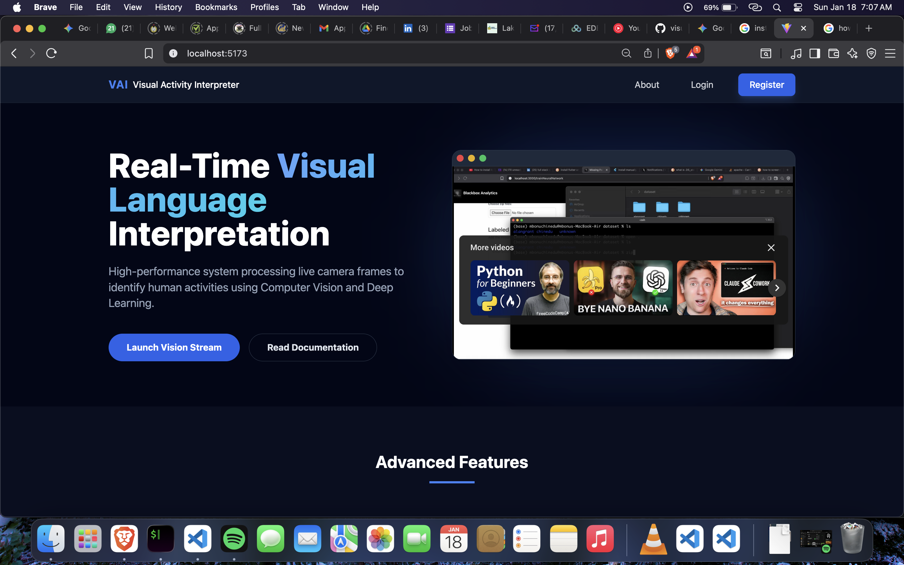

# Visual Activity Interpreter

<h3> Home Page </h3>



<h3> Data Flow Diagram </h3> 


This repository contains a high-performance **Visual Language Interpretation** system that processes real-time camera frames to identify and display user activities. By leveraging **Computer Vision**, **Deep Learning** and **Vision Language Models**, the program provides immediate, context-aware feedback by overlaying activity descriptions directly onto the video stream.

The architecture follows a cloud-native design pattern, ensuring scalability and efficient model inference.

## 🚀 Features


**Real-Time Video Analysis:** Processes live camera feeds to interpret human actions and gestures.

**Intelligent Overlay:** Displays a responsive and intuitive front-end that provides immediate user feedback based on model outputs.

**Computer Vision Backbone:** Utilizes **OpenCV** and **TensorFlow** (CNN models) for high-accuracy visual recognition.


**Scalable Backend:** Integrated via **Python/Node.js** services to manage state and serve model inferences.


## 🛠️ Technical Stack

**AI/ML:** Python, TensorFlow, Keras, OpenCV.

**Frontend:** React.js for the real-time visualization interface.

**Backend:** Flask (RESTful APIs).

**Cloud/DevOps:** AWS/Digital Ocean for hosting and data assets, with CI/CD via GitHub Actions.

## 🏗️ Architecture

The program follows an end-to-end pipeline designed for low-latency interpretation:

**Data Ingestion:** High-volume video frames are captured and pre-processed using custom extraction modules.

**Model Inference:** Features are extracted and passed through optimized **Deep Learning Vison** models.

**Visualization:** The React.js frontend renders the live stream with a dynamic UI layer that "interprets" the action in real-time.

## Dependencies For MacOS 

**Postgresql** : Ensure you install postgresql using the command line interface. 

```bash 
brew install postgresql
```


## 🔧 Installation & Setup

1. **Clone the repository:**
```bash
git clone https://github.com/cboychinedu/visual-interpreter.git
cd visual-interpreter

```

2. **Environment Setup:**
Ensure you have **Python 3.x** and **Node.js** installed.
```bash
pip install -r requirements.txt
npm install

```

2.1. **Setting your environment values:** 
Ensure you have your environment variables set inside the backend directory. Create a .env file inside the backend folder, and fill it with the following values, and add your parameters.: 
```bash
SECRET_KEY=""
DATABASE_HOST="localhost"
DATABASE_PORT="5432" 
DATABASE_PASSWORD=""
DATABASE_NAME=""
```

2.1. <b> Setting your environment values: </b> 
<p>
Ensure you have your environment variables set inside your frontend directory. Create a .env file inside your frontend directory, and fill the following: 
</p>

```bash 
REACT_APP_SERVER_URL=""
```

3. **Deployment:**


## 📝 Credentials & Recognition

This project utilizes patterns established during the **Google Build for SDG** and the **Facebook Andela** Machine Learning programs.

**Lead Engineer:** Engr Mbonu Chinedum **Contact:** [cmbonu@ymail.com](mailto:cmbonu@ymail.com) 
